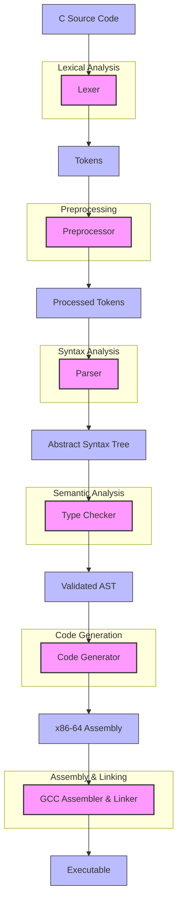

# TinyCC-RS: A Tiny C Compiler Written in Rust

TinyCC-RS is a small, educational C compiler implemented in Rust. It's inspired by projects like tcc (Tiny C Compiler) and chibicc, aiming to provide a simple yet functional C compiler that's easy to understand and extend.

## Features

- Complete compilation pipeline from C source to executable
- Lexical analysis (tokenization)
- Preprocessing with include file support
- Recursive descent parsing
- Type checking
- x86-64 assembly code generation with detailed comments
- Support for basic C constructs:
  - Variables and expressions
  - Control flow (if/else, while, for)
  - Functions with recursion
  - Basic I/O through standard library functions

## Project Structure

```
tinycc-rs/
├── src/                  # Source code
│   ├── ast.rs            # Abstract Syntax Tree definitions
│   ├── codegen.rs        # Assembly code generation
│   ├── error.rs          # Error handling
│   ├── lexer.rs          # Lexical analysis
│   ├── main.rs           # Main compiler driver
│   ├── parser.rs         # Syntax analysis
│   ├── preprocessor.rs   # C preprocessor
│   └── typechecker.rs    # Type checking
├── include/              # Standard library headers
│   └── stdio.h           # Basic I/O functions
├── tests/                # Test C programs
│   ├── factorial.c       # Recursive factorial calculation
│   ├── hello.c           # Hello world examples
│   └── ...               # Other test cases
├── output/               # Compiler output
│   ├── asm/              # Generated assembly files (.s)
│   └── bin/              # Compiled executables (.exe)
└── Cargo.toml            # Rust project configuration
```

## Getting Started

### Prerequisites

- Rust toolchain (rustc, cargo)
- GCC (for assembling and linking)

### Building

```bash
# Clone the repository
git clone https://github.com/abbychau/tinycc-rs.git
cd tinycc-rs

# Build the project
cargo build --release
```

### Usage

```bash
# Basic usage
cargo run -- path/to/source.c [output_name]

# Example
cargo run -- tests/factorial.c factorial
```

```bash
# (optional) Windows powershell helpers
./run_test.ps1 factorial
./run_all_tests.ps1
./test.ps1 factorial
```

This will:
1. Compile the C source file
2. Generate assembly in `output/asm/factorial.s`
3. Create an executable at `output/bin/factorial.exe`

## Examples

### Hello World

```c
// hello.c
#include <stdio.h>

int main() {
    puts("Hello, World!");
    return 0;
}
```

### Factorial Calculation

```c
// factorial.c
int factorial(int n) {
    if (n <= 1) {
        return 1;
    } else {
        return n * factorial(n - 1);
    }
}

int main() {
    return factorial(5);
}
```

### Variadic Functions

```c
// hello_printf.c
int printf(char *format, ...);

int main() {
    printf("Hello, %s! The answer is %d.\n", "World", 42);
    return 0;
}
```

More examples can be found in the `tests/` directory.

## Implementation Details

TinyCC-RS follows a traditional compiler architecture:

1. **Lexical Analysis**: Converts source code into tokens
2. **Preprocessing**: Handles include directives and macros
3. **Parsing**: Builds an Abstract Syntax Tree (AST)
4. **Type Checking**: Verifies type correctness
5. **Code Generation**: Produces x86-64 assembly code
6. **Assembly & Linking**: Uses GCC to create the final executable

The compiler targets the Windows x64 calling convention, with detailed comments in the generated assembly code to explain the low-level implementation.

### Compiler Data Flow



## Limitations

- Limited subset of C (no structs, unions, or complex types yet)
- Basic error reporting
- No optimizations
- Windows-focused (x86-64 assembly)

## Contributing

Contributions are welcome! Here are some ways you can contribute:

- Implement missing C features
- Improve error messages
- Add optimizations
- Extend platform support
- Write documentation and examples

## License

This project is licensed under the MIT License - see the LICENSE file for details.

## Acknowledgments

- Inspired by [tcc](https://bellard.org/tcc/) by Fabrice Bellard
- Influenced by [chibicc](https://github.com/rui314/chibicc) by Rui Ueyama
- Built with Rust and its amazing ecosystem
